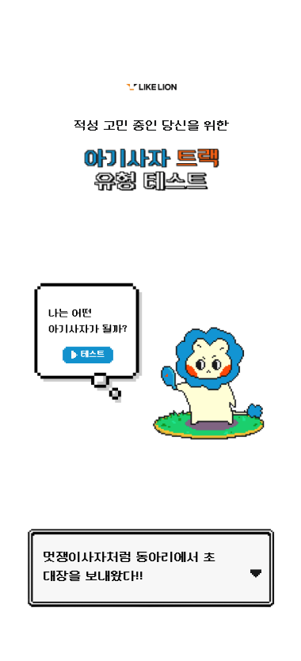
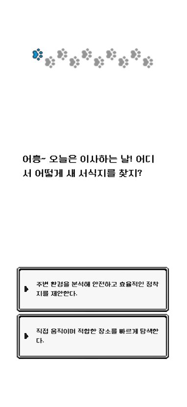
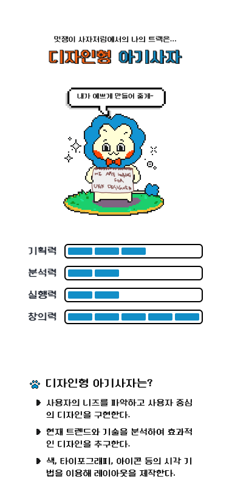
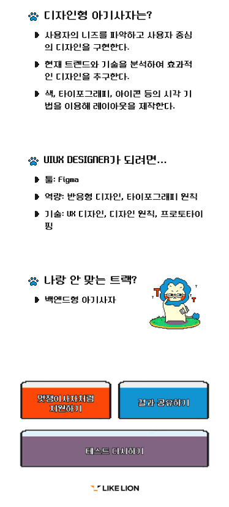

# **🦁 아기사자 테스트**

## 📝 소개

뭘 해야 할지 막막할 때, 조금이나마 적성을 찾는 데 도움이 되고자  
**멋쟁이사자처럼 금오공과대학교 13기 운영진들이 준비한 테스트**입니다!

---

## 🎨 화면 구성

### **초기 화면**

테스트 시작 화면에서 `"나는 어떤 아기사자가 될까?"` 또는 아래 `"멋쟁이사자처럼 동아리에서 초대장을 보내왔다!"`를 클릭하여 테스트를 시작할 수 있습니다.

|        초기 화면        |
| :---------------------: |
|  |

---

### **질문 화면**

각 질문마다 **두 개의 선택지**가 주어지며, 선택하면 **다음 질문으로 넘어갑니다**.

|         질문 화면         |
| :-----------------------: |
|  |

---

### **로딩 페이지**

질문을 모두 선택한 후, 결과를 받아오는 **로딩 화면**입니다.  
귀여운 캐릭터가 움직이는 모습을 볼 수 있습니다.

|         로딩 화면         |
| :-----------------------: |
|  |

---

### **결과 페이지**

질문을 모두 마치면 결과 페이지에서 **추천 트랙과 설명을 확인**하고 지원할 수 있습니다.

|         결과 페이지          |
| :--------------------------: | :--------------------------: |
|  |  |

---

## ⚙ **기술 스택**

### **Front-end**

  
  
  

### **Tools**

  
  
  
  

---

## 💁‍♂️ **프로젝트 팀원 (프론트엔드)**

|                                         **장은서**                                         |                                        **이민우**                                         |
| :----------------------------------------------------------------------------------------: | :---------------------------------------------------------------------------------------: |
|  |  |
|                          [GitHub](https://github.com/eunseojang)                           |                          [GitHub](https://github.com/minwoo1119)                          |

---
